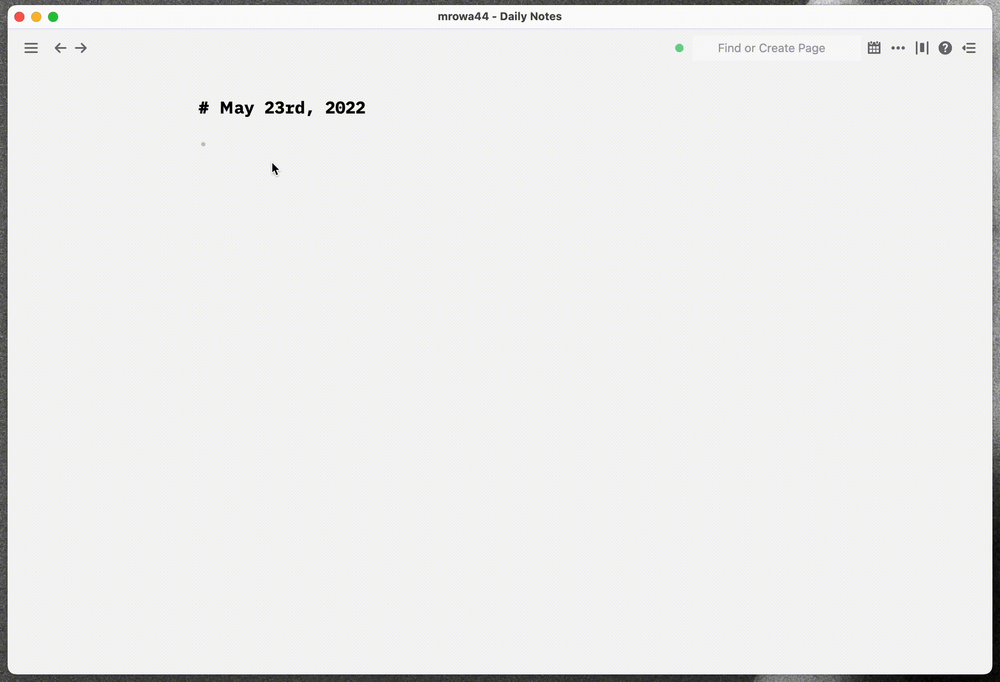

# Roam Research iA Writer theme

[[roam/css]] page:

```css
@import url('https://mrowa44.github.io/roam-ia-writer/output.min.css');

:root {
  --ff-main: "iA Writer Duo"; 
  /* default, other: "iA Writer Mono", "iA Writer Quattro" */

  --fs-main: 20px;
}

```

Optionally, copy the [script.js](script.js) content to [[roam/js]] page


Features:
- iA Writer fonts
- Todos style
- Focus mode
- Autofocuses the last focused block on returning to roam (like a normal editor does)


### Demo




### Contributing

To build run: `./combine.sh`
